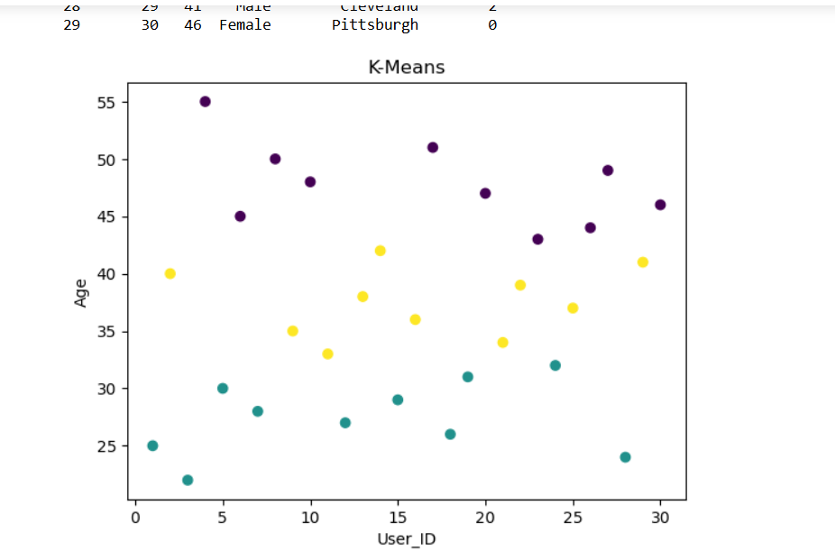

### EX4 Implementation of Cluster and Visitor Segmentation for Navigation patterns
### Name: Narendran K
### DATE: 18.09.2025
### AIM: To implement Cluster and Visitor Segmentation for Navigation patterns in Python.
### Description:
<div align= "justify">Cluster visitor segmentation refers to the process of grouping or categorizing visitors to a website, 
  application, or physical location into distinct clusters or segments based on various characteristics or behaviors they exhibit. 
  This segmentation allows businesses or organizations to better understand their audience and tailor their strategies, marketing efforts, 
  or services to meet the specific needs and preferences of each cluster.</div>
  
### Procedure:
1) Read the CSV file: Use pd.read_csv to load the CSV file into a pandas DataFrame.
2) Define Age Groups by creating a dictionary containing age group conditions using Boolean conditions.
3) Segment Visitors by iterating through the dictionary and filter the visitors into respective age groups.
4) Visualize the result using matplotlib.

### Program 1:
```
import pandas as pd
df=pd.read_csv("C:\\Users\\admin\\Downloads\\clustervisitor.csv")
df.head()
cluster={"young":(df['Age']<=30),"Middle":((df['Age']>30)&(df['Age']<=60)),"Old":(df['Age']>50)}
count=[]
for g,c in cluster.items():
    visitor=df[c]
    count.append(len(visitor))
    print(f"Visitors in {g} group")
    print(visitor)
    print(count)
plt.bar(cluster.keys(),count,data=df)
plt.xlabel('Age Group')
plt.show()
### Visualization:

```

### Output 1:


### Program 2 :
```
from sklearn.cluster import KMeans
import matplotlib.pyplot as plt
df=pd.read_csv("C:\\Users\\admin\\Downloads\\clustervisitor.csv")
kmeans = KMeans(n_clusters=3, random_state=42)
df['Cluster'] = kmeans.fit_predict(df[['Age']])
print(df)
plt.scatter(df['User_ID'], df['Age'], c=df['Cluster'])
plt.xlabel('User_ID')
plt.ylabel('Age')
plt.title('K-Means')
plt.show()

```

### Output 2:



### Result:

Thus,to implement Cluster and Visitor Segmentation for Navigation patterns in Python is executed successfully
